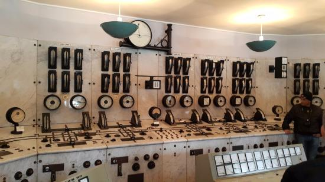

<button type="button" onclick="window.location.href='index.html';">Homepage</button>
<button type="button" onclick="alert('This is the first chapter!')">Previous</button>
<button type="button" onclick="window.location.href='KapII.html';">Next</button>

# What is PLCopen and IEC61131-3?

Imagine you're a butler serving the Grandet family. Been Grandets, they hire no valet nor footman to share your load and expect you to do all the household chores. You are smart (but perhaps not that smart, judging from your choice of career), so you decide to automate some of your tasks using machines. You remember that once you were cooking dinner, and then the Grandets went back from the _Miser's Salon_. They rang the bell and waited at the door, as apparently they would never condescend to open it. You heard the bell, so you had to put down all the work on your hands, turned off the stove, and ran to answer the door. Afterwards, they haughtily blamed you for taking too long. This experience is traumatizing, therefore you decided to start from here.

You purchased a motor (using your own salary, of course), installed it onto the door and wired up a switch in the kitchen so you can remotely control the door. You also placed a video camera outside the front door so the Grandets do not need to ring the bell. The system performed well, and the Grandets stopped grumbling about your untimley answering. You decided to extend the system to other chores, like opening the window, pulling the curtain and adding firewoods to the hearth. These systems worked very well and help you to reduce a lot of work. It's just that your kitchen is now full of flying wires, screens and dashboards. 

So you bought some microcontrollers and breadboard (or a _programmable logic controller, PLC_) from a company in Saumur so as to centralize these control circuits. At the same time, you realized that you can write some simple programs to perform logical operations, such as activiting the nearby mechanism to add firewood to the hearth when the temperature sensor detects a temperature drop. In order to do so, you have to learn the programming language adopted by the chip manufacturer first. You mastered that programming language during the laundry time. The new implementation is much more compact and easy to maintain. 

You are happy with the new system, so are the Grandets. When they're paying their compliments to you (in words of course), they asks you to take over the maintenance job of a mansion sited in Paris. The Paris mansion had a similar automated housekeeping system developed by a former butler, who quit the job due to low salary. Though been quite alike to yours, the Paris system is operating on a different and mutually incompatible language. Enough is enough, you think. It's time to find a employer with mercy. You heard that a nice gentleman, Herr Doktor Peter Kien is looking for a housekeeper...

***
According to Wikipedia,
> PLCopen was founded in 1992 just after the world wide programming standard IEC 61131-3 was published. The controls market at that time was a very heterogeneous market with different types of programming methods for many different PLCs. The IEC 61131-3 is a standard defining the programming languages for PLCs, embedded controls, and industrial PCs, harmonizing applications independent from specific dialects, but still based on known methods such as the textual programming languages Instruction List, and Structured Text, the graphical programming languages Function Block Diagram and Ladder Diagram (a.k.a. Ladder logic), and the structuring tool Sequential Function Chart.
> - [_Wikipedia_](https://en.wikipedia.org/wiki/PLCopen)

One of the biggest achievement of the programming standard IEC 61131-3 is solving the problem faced by our poor butler. In such case, the end users usually have a wide range of hardware for motion control available in the market. At the meantime, end users also face a great variety of IDEs that are developed in isolation by those hardware suppliers. As a result, these IDEs are mutually incompatible such that even if the required functions remains exactly the same, the software needs to be utterly rewritten to accommodate new hardware of different brand. 

An important part of this programming standard is its motion control function block. These function blocks (FB for short) are structures  abstracted from the physical processes of motion control. These FB are defined at the interface and data structure level, which thereby leaves the actual implementation of the FBs to manufacturers. In doing so, the programming standard becomes entirely independent of the hardware system, which reduces the cost of transplantation, maintenance cost and the learning costs of different languages.

<button type="button" onclick="window.location.href='#top';">Back To Top</button>

