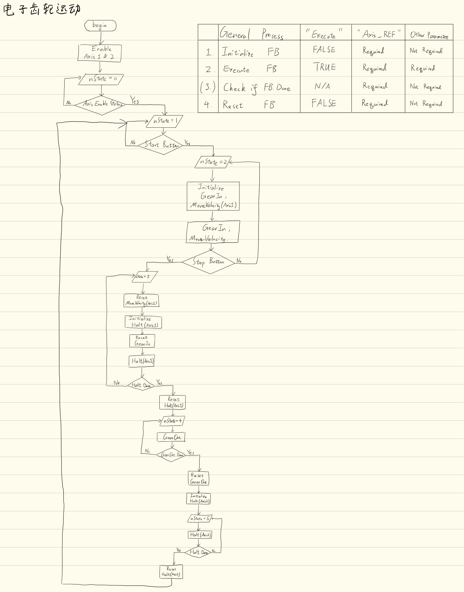

<p style="text-align:center;">
<button type="button" onclick="window.location.href='index.html';">Homepage</button>
<span style="float:left;"><button type="button" onclick="alert('This is the first chapter!')">Previous</button></span>
<span style="float:right;"><button type="button" onclick="window.location.href='ch3.html';">Next</button></span>
</p>

# What is Electronic Gear?
In pure mechanical systems, the rotational speeds of two axes can be adjusted by a set of gears. The drawbacks of such design are:

1. Once set up, the speed ratio between the axes is fixed. It is difficult and expensive to adjust the speed ratio, because the old gears may need to be replaced.
2. Takes up room.
3. Induces mechanical losts and generates noise.

One way to overcome the aforesaid disadvantages is to replace the pure mechanical system with two motors controlled by a PLC. The speed ratio between the two motors is defined by the onboard program and can be easily modified.

***

# Planning


***

# Code
```
PROGRAM PLC_PRG
VAR
	fbPower1, fbPower2 	:	SM3_Basic.MC_Power;
	fbHalt		:		SM3_Basic.MC_Halt;
	fbStartRtrig, fbStopRtrig 	:	Standard.R_TRIG;
	fbMoveVel	:	SM3_Basic.MC_MoveVelocity;
	fbGearIn	:	SM3_Basic.MC_GearIn;
	fbGearOut	:	SM3_Basic.MC_GearOut;
	
	nState		:	INT;
	myEnable, startFlag, stopFlag :	BOOL;
	fbStop1, fbStop2:	SM3_Basic.MC_Stop;	
	
	gearRatioNumerator	:	Uint;
	gearRatioDemonimator:	UINT;
END_VAR
```

```
IF myEnable THEN
	fbPower1(Axis:=myAxis1, Enable:=1, bRegulatorOn:=1, bDriveStart:=1);
	fbPower2(Axis:=myAxis2, Enable:=1, bRegulatorOn:=1, bDriveStart:=1);
END_IF
readAxisStatus();

CASE nState OF
	0:	(* Check whether the motors are enabled *)
		IF fbPower1.Status AND fbPower2.Status THEN
			IF statusX = 'StandStill' AND statusY = 'StandStill' THEN
				nState:=1;
			ELSE 
				runReset();
				IF resetDone THEN
					nState:=1;
					resetDone:=0;
				ELSE
					nState:=0;
				END_IF
			END_IF
		END_IF
	1:	(* Check Start button *)
		fbStartRtrig(CLK:=startFlag);
		IF fbStartRtrig.Q THEN
			// initialize GearIn & MoveVel
			// jump to nState 2
			fbGearIn(Master:=myAxis1, Slave:=myAxis2, Execute:=0);
			fbMoveVel(Axis:=myAxis1, Execute:=0);
			nState:=2;
		END_IF
	2:	(* Execute MoveVel(Axis1) and couple the gears *)
		fbGearIn(Master:=myAxis1, Slave:=myAxis2, Execute:=1, RatioNumerator:=gearRatioNumerator, RatioDenominator:=gearRatioDemonimator, Acceleration:=7200, Deceleration:=7200);
		// check if coupling is finished, if so, execute MoveVelocity
		fbMoveVel(Axis:=myAxis1, Execute:=fbGearIn.InGear, Velocity:=360, Acceleration:=7200, Deceleration:=7200, Direction:=SM3_Basic.MC_DIRECTION.positive);
		IF fbMoveVel.InVelocity THEN
			fbStopRtrig(CLK:=stopFlag);
			IF fbStopRtrig.Q THEN
				nState:=3;
			END_IF
		END_IF
		
	3:	(* Check Stop Button *)
		fbGearOut(Slave:=myAxis2, Execute:=1);
		IF fbGearOut.Done THEN
			fbStop1(Axis:=myAxis1, Execute:=1, Deceleration:=7200);
			IF fbStop1.Done THEN
				nState:=4;
				fbStop1(Axis:=myAxis1, Execute:=0);
			END_IF
		END_IF
	4:
		fbStop2(Axis:=myAxis2, Execute:=1, Deceleration:=7200); 
		IF fbStop2. Done THEN
			fbStop2(Axis:=myAxis2, Execute:=0);
		END_IF
		nState:=0;
END_CASE
```

# Summary
blah blah blah

<p style="text-align:center;">
<button type="button" onclick="window.location.href='#top';">Back To Top</button>
<p>
