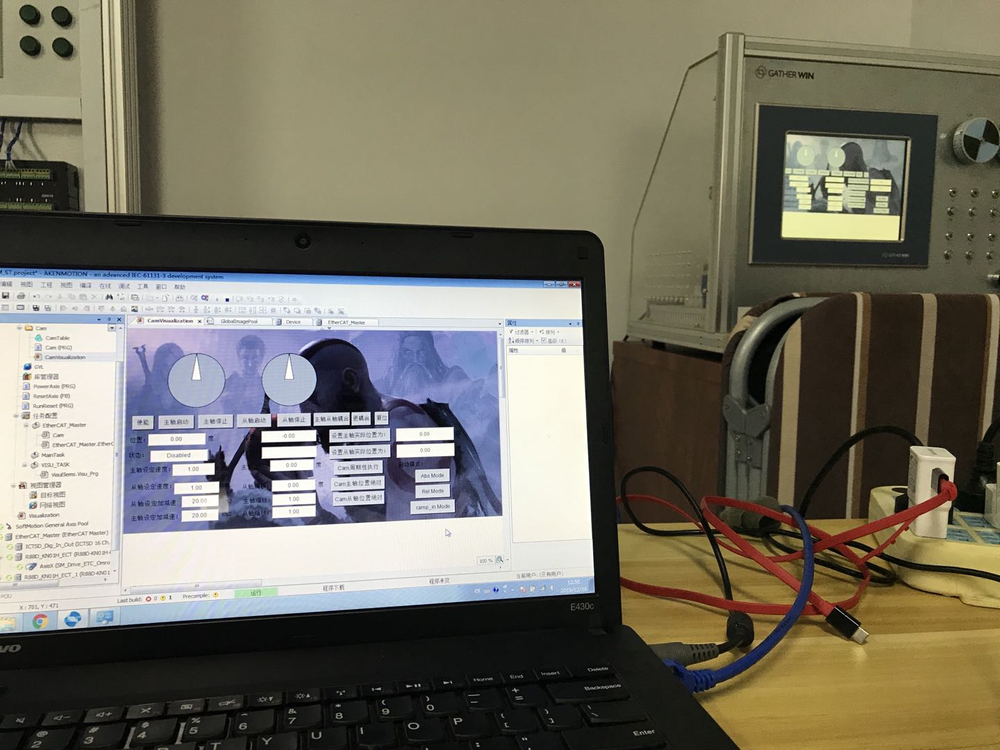

The notes here are taken for the motion control standard _PLCopen IEC61131-3_ during my internship @Gatherwin. These notes serve as a reminder and quick review material for future use.

# IDE
The IDE I used for the exercises is [AKENMOTION](http://www.gatherwin.com.cn/En/chain.asp?SortID=14) developed by [GATHERWIN](http://www.gatherwin.com.cn/En/main.asp).

# Hardware Platform
The hardware platform I used is a teaching platform manufactured by GATHERWIN. It consists of two Omoron motors, one touch screen and a button panel. The platform is sufficient for most of the exercises involving motion control.

***

## **Table of Content**

* [**Kapitel I: What is PLCopen and IEC61131-3?**](KapI.html)
* [**Kapitel II: Motion Control Theory**](KapII.html)
* [**Kapitel III: Brief Intro to Function Block**](KapIII.html)
* **Kapitel IV: Exercises**
  * [**Übung vi: Electronic Gears**](Uebung_vi_Electronic_gears.html)
